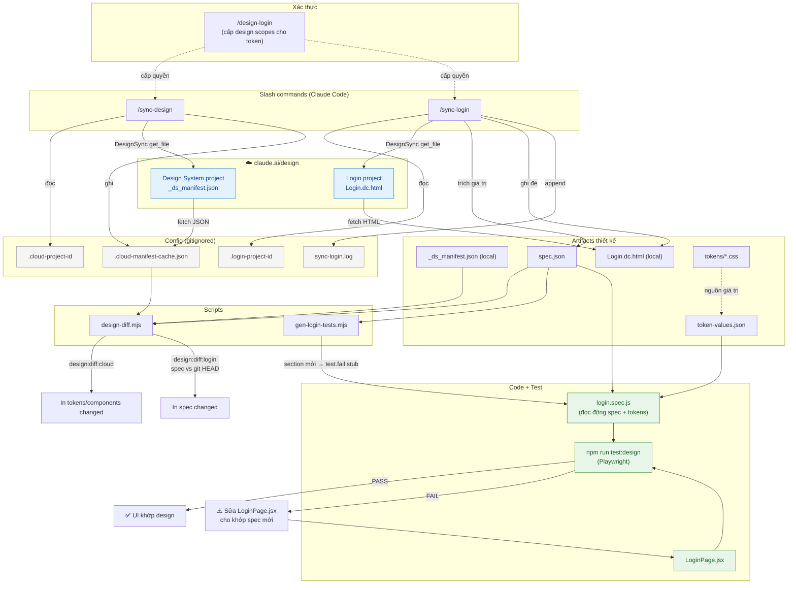

# Design Sync Flow — Tổng quan

Tài liệu mô tả toàn bộ luồng đồng bộ giữa **Claude Design (cloud)** và **code local**, gồm 2 nhánh: **Design System** và **Login Page**. Dùng file này để đưa AI vẽ sơ đồ Mermaid, hoặc đọc trực tiếp sơ đồ có sẵn ở cuối.

---

## 1. Hai nhánh sync

| Nhánh | Nguồn cloud | Lệnh | File theo dõi | Cơ chế diff |
|-------|-------------|------|---------------|-------------|
| **Design System** | `claude.ai/design` — Verity Design System project | `/sync-design` | `Verity Design System/_ds_manifest.json` | So manifest local vs cloud cache |
| **Login Page** | `claude.ai/design` — Login project riêng | `/sync-login` | `Tạo trang login/design_handoff_login/spec.json` | So spec.json local vs git HEAD |

Cả hai project đều nằm trên `claude.ai/design` nên fetch được bằng công cụ **DesignSync** (cần đã chạy `/design-login` để cấp design scopes cho token).

---

## 2. Các thành phần (files)

### Config (gitignored — không push)
- `scripts/.cloud-project-id` — project ID của Design System
- `scripts/.login-project-id` — project ID của Login page
- `scripts/.cloud-manifest-cache.json` — cache manifest fetch về từ cloud
- `scripts/sync-login.log` — lịch sử các lần sync login (append mỗi lần)
- `verity-app/scripts/` — thư mục rác bị tạo khi skill chạy sai cwd (ignored)

### Scripts
- `scripts/design-diff.mjs` — diff engine, hỗ trợ `--source cloud`, `--page login`, `--summary`
- `scripts/gen-login-tests.mjs` — tự sinh stub test `test.fail()` cho spec section chưa có test
- `scripts/token-values.json` — mapping design token (`--space-8`) → giá trị CSS (`32px`)

### Artifacts thiết kế
- `Verity Design System/_ds_manifest.json` — tokens + components của design system
- `Verity Design System/tokens/*.css` — nguồn gốc giá trị token
- `Tạo trang login/design_handoff_login/spec.json` — spec đo được của login page
- `Tạo trang login/design_handoff_login/Login.dc.html` — bản HTML design fetch từ cloud

### Code + Test
- `verity-app/src/pages/LoginPage.jsx` — UI thực tế cần khớp spec
- `verity-app/tests/login.spec.js` — Playwright test, đọc **động** từ `spec.json` + `token-values.json`

### Slash commands
- `.claude/commands/sync-design.md`
- `.claude/commands/sync-login.md`

---

## 3. Luồng `/sync-design` (Design System)

1. Đọc `scripts/.cloud-project-id` → lấy projectId.
2. `DesignSync(get_file)` fetch `_ds_manifest.json`.
   - Nếu auth lỗi → fallback: yêu cầu user paste manifest thủ công.
3. Thêm `_cloudSyncedAt`, `_cloudProjectId` → ghi `scripts/.cloud-manifest-cache.json`.
4. `npm run design:diff:cloud` → so tokens/components local vs cache, in ra thay đổi.
5. Báo tóm tắt what changed.

## 4. Luồng `/sync-login` (Login Page)

1. Đọc `scripts/.login-project-id` → lấy projectId.
2. `DesignSync(get_file)` fetch `Login.dc.html`.
   - Nếu auth lỗi → fallback: yêu cầu user paste HTML thủ công.
3. Đọc `spec.json` + `README.md` làm baseline; trích giá trị đo được từ HTML.
4. Nếu có thay đổi:
   - Update `spec.json` + ghi đè `Login.dc.html`.
   - `npm run design:diff:login` → in diff spec vs git HEAD.
   - `npm run design:gen-tests:login` → **tự thêm stub test** cho section mới.
   - Append `scripts/sync-login.log`.
5. Nếu không đổi: vẫn chạy gen-tests (bắt section bỏ sót), ghi log "No changes".
6. Nhắc user: implement stub trong `LoginPage.jsx`, viết assertion thật, chạy `npm run test:design`.

## 5. Vì sao test tự phản ánh design

- `login.spec.js` **không hardcode** — nó `readFileSync(spec.json)` và `token-values.json` lúc chạy.
- Đổi giá trị (vd height 44→48) trong spec → test tự so giá trị mới → **FAIL** nếu UI chưa đổi.
- Thêm **section mới** (vd `visibilityToggle`) → `gen-login-tests.mjs` sinh `test.fail()` stub → suite đỏ tới khi implement.
- `token-values.json` map token → CSS value để so `getComputedStyle` (vd `--accent-primary` → `rgb(37, 99, 235)`).

---

## 6. Sơ đồ Mermaid

---

## 7. Quy tắc vận hành

- **Không auto commit/push** — chỉ commit khi user yêu cầu rõ.
- Project ID và cache **luôn gitignored** — không lộ lên repo public.
- Mỗi lần đổi design: `/sync-login` → xem diff → implement JSX → `npm run test:design` → xanh mới xong.
