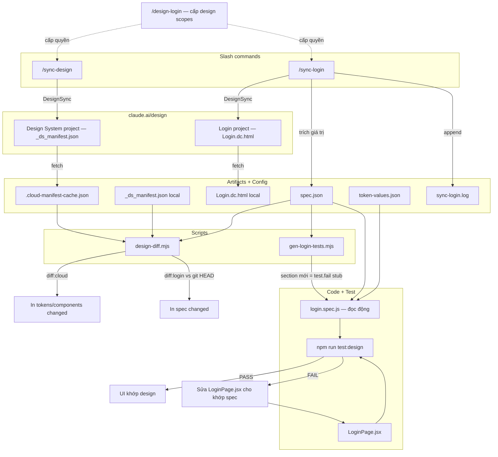

# 🔄 Design Sync Flow

Luồng đồng bộ giữa **Claude Design (cloud)** và **code local**, gồm 2 nhánh: **Design System** và **Login Page**.

> 💡 Copy toàn bộ file này dán vào Notion. Với khối Mermaid ở cuối: sau khi dán, bấm vào code block → đổi ngôn ngữ sang **Mermaid** để hiện sơ đồ.

---

## 📌 Tổng quan 2 nhánh

| Nhánh | Nguồn cloud | Lệnh | File theo dõi |
| --- | --- | --- | --- |
| Design System | claude.ai/design — Verity Design System | `/sync-design` | `_ds_manifest.json` |
| Login Page | claude.ai/design — Login project riêng | `/sync-login` | `spec.json` |

Cả hai đều nằm trên claude.ai/design → fetch bằng công cụ **DesignSync** (cần chạy `/design-login` trước để cấp quyền cho token).

---

## 🗂️ Các thành phần

**Config (gitignored — không push lên GitHub)**

| File | Vai trò |
| --- | --- |
| `scripts/.cloud-project-id` | Project ID của Design System |
| `scripts/.login-project-id` | Project ID của Login page |
| `scripts/.cloud-manifest-cache.json` | Cache manifest fetch về từ cloud |
| `scripts/sync-login.log` | Lịch sử các lần sync login (append) |

**Scripts**

| File | Vai trò |
| --- | --- |
| `scripts/design-diff.mjs` | Diff engine: `--source cloud`, `--page login`, `--summary` |
| `scripts/gen-login-tests.mjs` | Tự sinh stub test cho spec section chưa có test |
| `scripts/token-values.json` | Map token `--space-8` → giá trị CSS `32px` |

**Artifacts thiết kế**

| File | Vai trò |
| --- | --- |
| `Verity Design System/_ds_manifest.json` | Tokens + components của design system |
| `Verity Design System/tokens/*.css` | Nguồn gốc giá trị token |
| `.../design_handoff_login/spec.json` | Spec đo được của login page |
| `.../design_handoff_login/Login.dc.html` | Bản HTML design fetch từ cloud |

**Code + Test**

| File | Vai trò |
| --- | --- |
| `verity-app/src/pages/LoginPage.jsx` | UI thực tế cần khớp spec |
| `verity-app/tests/login.spec.js` | Playwright test, đọc động từ spec + token map |

---

## 🎨 Luồng `/sync-design`

1. Đọc `.cloud-project-id` → lấy projectId
2. `DesignSync(get_file)` fetch `_ds_manifest.json` *(auth lỗi → fallback paste thủ công)*
3. Thêm metadata → ghi `.cloud-manifest-cache.json`
4. `npm run design:diff:cloud` → so tokens/components local vs cache
5. Báo tóm tắt thay đổi

---

## 🔐 Luồng `/sync-login`

1. Đọc `.login-project-id` → lấy projectId
2. `DesignSync(get_file)` fetch `Login.dc.html` *(auth lỗi → fallback paste thủ công)*
3. Đọc `spec.json` + `README.md` làm baseline, trích giá trị đo được từ HTML
4. Nếu có thay đổi:
    - Update `spec.json` + ghi đè `Login.dc.html`
    - `npm run design:diff:login` → in diff spec vs git HEAD
    - `npm run design:gen-tests:login` → tự thêm stub test cho section mới
    - Append `sync-login.log`
5. Nếu không đổi: vẫn chạy gen-tests, ghi log "No changes"
6. Nhắc: implement stub trong `LoginPage.jsx` → viết assertion thật → `npm run test:design`

---

## ⚙️ Vì sao test tự phản ánh design

> ✅ `login.spec.js` **không hardcode** — nó đọc `spec.json` + `token-values.json` ngay lúc chạy test.

- Đổi giá trị (vd height `44 → 48`) trong spec → test so giá trị mới → **FAIL** nếu UI chưa đổi
- Thêm **section mới** (vd `visibilityToggle`) → `gen-login-tests.mjs` sinh `test.fail()` stub → suite đỏ tới khi implement
- `token-values.json` map token → CSS value để so với `getComputedStyle` (vd `--accent-primary` → `rgb(37, 99, 235)`)

---

## 🧭 Sơ đồ luồng

---

## 📋 Quy tắc vận hành

- 🚫 **Không auto commit/push** — chỉ commit khi yêu cầu rõ ràng
- 🔒 Project ID và cache **luôn gitignored** — không lộ lên repo public
- 🔁 Mỗi lần đổi design: `/sync-login` → xem diff → implement JSX → `npm run test:design` → xanh mới xong
